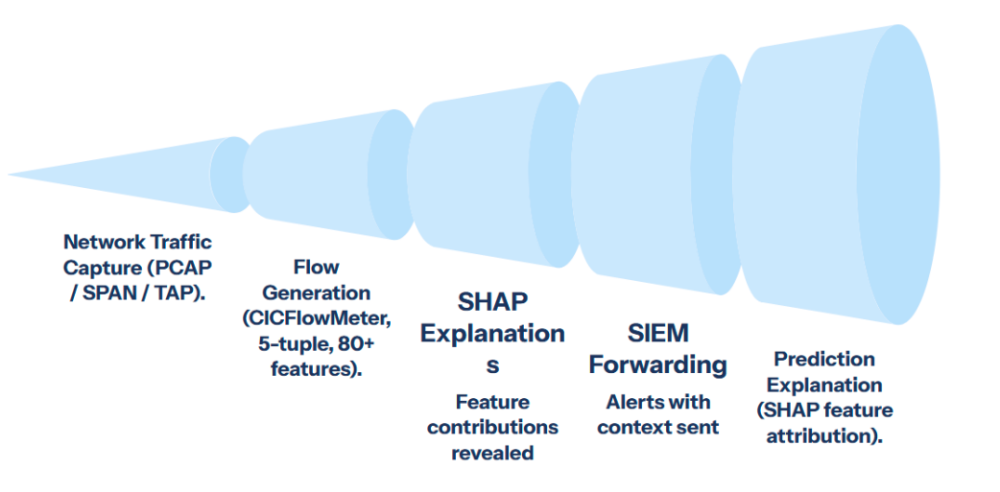
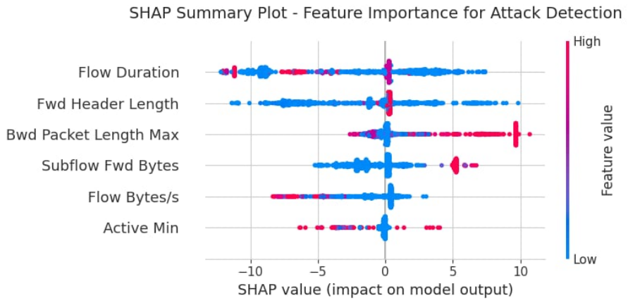
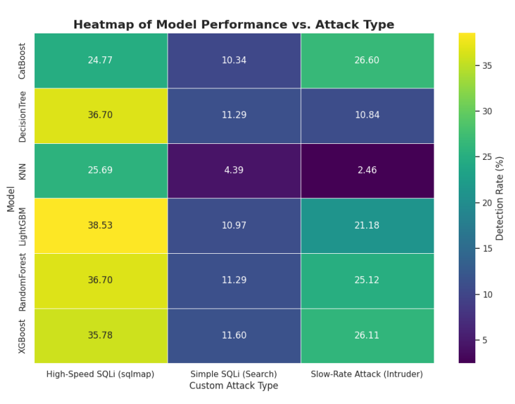

# 🔐 Real-Time Web Attack Detection using Machine Learning

**A high-performance cybersecurity system for detecting SQL Injection (SQLi) and Cross-Site Scripting (XSS) attacks using flow-based machine learning, with benchmarking on CICIDS2017 and real-world validation via Docker-based attack simulations.**


[](Project_Report.pdf)

---

## 👥 Authors

- **Ahsan Rizvi**
- **Umme Hani Roshni**
- **Amanullah Ahsan** 
- **Mohammad Irtiza Hossain Mahmud**
- **Md. Tanvir Islam Shikdar**

*Department of Electrical and Computer Engineering, North South University*

---

## 🛡️ Abstract

Web application attacks such as SQL Injection (SQLi) and Cross-Site Scripting (XSS) continue to evolve, often bypassing traditional signature-based firewalls. This project presents a **flow-based intrusion detection system** that identifies malicious behavior using statistical network features rather than payload inspection, making it effective even for encrypted traffic.

We evaluate multiple machine learning models using the **CICIDS2017 benchmark dataset**, followed by stress-testing against **custom real-world attack traffic generated using Docker and Kali Linux**. While near-perfect results are achieved on benchmark data, real-world testing exposes generalization challenges, highlighting the importance of continuous retraining and adaptive security pipelines.

---

## ✨ Key Features

- **Flow-Based Detection**  
  Uses statistical network flow features (packet size, timing, duration) instead of payload inspection.

- **Real-Time Inference**  
  XGBoost model achieves sub-millisecond prediction latency, suitable for live monitoring systems.

- **Explainable AI (SHAP)**  
  Provides feature-level explanations for every prediction, improving transparency and trust.

- **Raw PCAP Support**  
  Direct ingestion of `.pcap` / `.pcapng` files using `pyshark` and CICFlowMeter-style flow extraction.

---

## 🏗️ System Workflow

The end-to-end pipeline from network traffic to classification:

1. **Traffic Capture** — Raw packets captured from victim servers (`.pcap`).
2. **Feature Extraction** — Network flows generated to match training schema.
3. **ML Inference** — Trained model predicts: Normal / SQLi / XSS in real time.



---

## 📊 Performance Evaluation (CICIDS2017)

Multiple classifiers were evaluated. XGBoost provided the best balance of speed and accuracy.

| Metric | XGBoost (Proposed) | Random Forest | SVM |
|--------|--------------------|---------------|-----|
| **Accuracy** | **99.99%** | 99.92% | 94.50% |
| **Precision** | **99.99%** | 99.94% | 96.80% |
| **Recall** | **99.99%** | 99.92% | 94.50% |
| **Latency (s)** | **0.000049** | 0.042 | 52.12 |

### 🔍 Explainability with SHAP

SHAP analysis revealed that:

- Forward Packet Length  
- Flow Duration  
- Packet Inter-arrival Time  

are the most influential features in detecting attack traffic.



---

## 🌍 Real-World Validation

To evaluate robustness beyond academic datasets, we generated **live attack traffic using Dockerized vulnerable web servers and Kali Linux attack containers**.

### Key Findings

- Models trained only on CICIDS2017 showed **significant performance degradation** on novel attack patterns.
- Detection rate dropped to approximately **24–30%** on zero-day style simulations.
- This demonstrates **dataset shift** and highlights the risk of relying solely on static benchmark datasets.

### Research Insight

> High benchmark accuracy does not guarantee real-world robustness.  
> Continuous retraining and live traffic feedback loops are essential for production-grade IDS systems.



---

## 🚀 Getting Started

### ✅ Requirements

- Python 3.8+
- Wireshark (with `tshark` available in system PATH)

---

### 📦 Installation

Clone the repository and install dependencies:

```bash
git clone https://github.com/ahsanrizvi99/web-attack-detection.git
cd web-attack-detection
pip install -r requirements.txt
````

---

### ▶️ Run Detection on PCAP

To test on sample captured traffic:

1. Navigate to `attack_detection/`
2. Open `Detection_Engine.ipynb`
3. Ensure input file is set to: `sqli_attack_capture.pcapng`
4. Run all cells to generate predictions

The notebook will:

* Extract flows
* Normalize features
* Run inference
* Output attack classification

---

### 🔁 Retrain the Model

To reproduce training and evaluation:

Open and run:

```text
training_analysis/Model_Training.ipynb
```

This notebook performs:

* Data preprocessing
* Model training
* Benchmark evaluation
* SHAP explainability analysis

---

## 📂 Repository Structure

```text
/Real-Time-Web-Attack-Detection
│
├── attack_detection/           # Real-time inference engine
│   ├── Detection_Engine.ipynb
│   ├── xgboost_sqli_xss_detector.joblib
│   ├── data_scaler.joblib
│   ├── deployment_info.json
│   └── sqli_attack_capture.pcapng
│
├── training_analysis/          # Model training & evaluation
│   └── Model_Training.ipynb
│
├── assets/                     # Figures and diagrams
├── requirements.txt
└── README.md
```

---

## 📜 License

This project is licensed under the **MIT License**.
See the `LICENSE` file for details.

